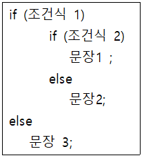
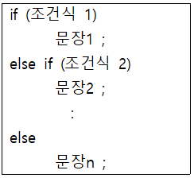
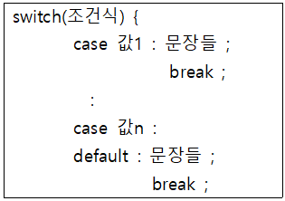

1. **중첩 if** :   
if문 안에 if문이 들어가 있는 상태의 조건문으로서 조건식1이 참일 경우 조건식2를 검사하는 방식으로 실행한다.

- 여러 개의 if와 else가 있을 경우, else는 가장 가까운 if와 쌍을 이룬다.  
- 다른 제어를 원할 경우엔, 중괄호( { })를 이용하여 블록을 만들어서 제어의 흐름을 조정한다.
2. **조건문 if ~ else if ~ else** :   
if~else를 연속해서 작성하는 형태로서 조건식1이 참일 경우 문장1을 수행하고, 조건식1이 거짓이면서 조건식2가 참일 경우 명령2를 수행하는 방식이다. 마지막 else에는 앞에 기술된 조건들이 모두 거짓일 경우 수행할 문장을 적는다.

3. **다중 분기문 switch** :   
조건식의 결과가 참과 거짓으로만 판명되지 않고 여러 경우로 분기되는 경우에 적합한 문장이다.

- 조건식의 결과는 반드시 정수이어야 한다.
- 조건식의 결과 값에 따라 여러 경우로 분기시켜서 해당 문장들을 수행할 수 있다. case마다 수행할 문장 마지막에 꼭 break문을 넣어서 해당 case를 수행한 후 switch 문을 빠져나갈 수 있게 해줘야 한다.