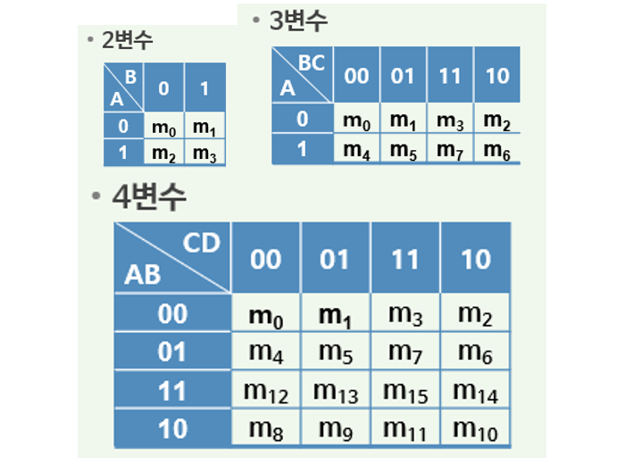

1. 카르노맵

2. Karnaugh MAP에 의한 간략화 방법
   1. (진리표를이용하여) 부울함수를 SOP 형식으로 표현함(출력인 1인 최소항)
   2. 부울함수 F의 각 최소항에 1을 표시
   3. 부정의 항(Don't care)이 있다면 동일한 방법으로각 최소항에 d를 표기함
   4. 인접한 항 끼리 2n항(즉2, 4, 8...)개의 항 씩 묶음, 이때 중복된 항이 존재해도 무방함
   5. 묶여진 항에서 변수값의변화를 관찰하여 변수값이변화하면(0, 1공존) 그 변수는 버림
   6. 묶여진 항을 표준형으로 표기함
3. NAND Gate / NOR Gate 변환

