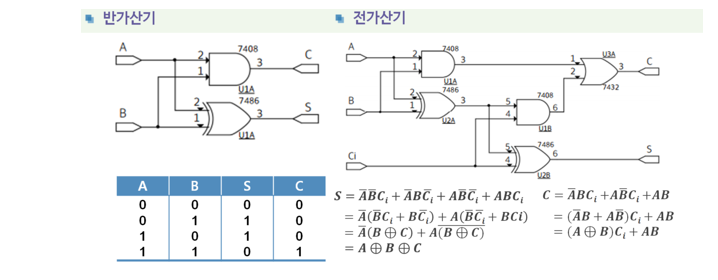

1. 조합 논리 회로의 설계 순서
   - 디지털 시스템의 기능에 필요한 입력 변수와 출력 변수의 수를 결정한 다음 각각의 신호에 기호를 부여하여 블록도를 그린다.
   - 입출력 변수 간의 진리표를 작성한다.
   - 진리표를 이용하여 논리식을 작성하고 카노프 맵이나 부울 대수를 이용하여 작성된 논리식을 간략화 를 진행 한다.
   - 간략화된 논리식을 이용하여 논리회로를 그린다
2. 가산기
