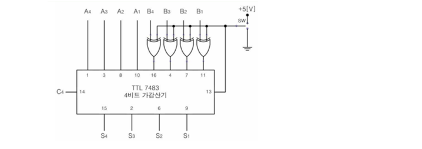
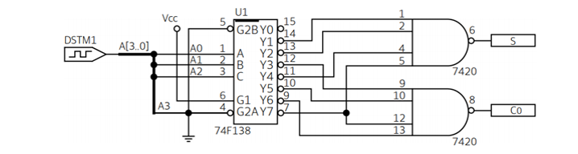

1. 7483 (4Bit 병렬 가산기)를 이용한 4Bit 가감산기
   - TTL-7483 IC와 XOR Gate의 특성을 이용한 제어형 인버터를 사용하여 두 개의 2진수 A와 B의 가산과 감산을 수행할 수 있도록 한 가감산기

2. 인코더

3. 부울 함수의 MUX에 의한 구현
   - 선택선 I0 I1 I2 I3 순으로 함수 실현표를 채움 
   - 입력 변수 A(또는 B, C 중 하나)를 선택하고 그 외 나머지 변수는 선택선으로 이용 
   - A를 기준으로 A=0인 항과 A=1인 항으로 나누고 최소항 번호를 채움 
   - 출력이 1인 최소항에 O표시를 함
     - 두 최소항 모두가 O표이면 MUX 입력값은 1
     - 두 최소항 모두가 O표가 없으면 MUX 입력값은 0
     - A항만 O표이면 MUX 입력값은 A
     - A'항만 O표이면 MUX 입력값은 A'
   - 최종적으로 MUX의 입력과 선택 변수를 기입함