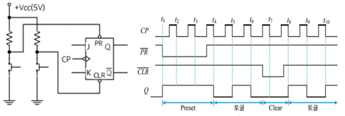

1. 플립플롭의 비동기 입력 (Preset ＆ Clear)

2. 플립플롭의 동작 특성
- 전파 지연 시간 (Propagation Delay Time) : 입력 신호가 가해진 후 출력에 변화가 일어날 때까지의 시간 간격
- 설정 시간(Set-Up Time) : CP 의 상승에지 변이 전에 입력값은 일정 시간 동안 유지해야 함.
- 보류 시간 (Hold Time) : CP 가 상승에지 변이 이후에도 입력값이 변해서는 안 되는 일정한 시간
- 최대 클럭 주파수 : 플립플롭이 안전하게 동작할 수 있는 최대 주파수
- 전력 소모 : = DC 공급전압 평균 공급전류 (P= Vcc × Icc )
3. 멀티바이브레이터  
   · 멀티바이브레이터(multivibrator)는 디지털 시스템에서 매우 중요하게 사용되는 것 중의 하나  
   · 멀티바이브레이터는 디지털 시스템에서 2진수를 저장하고, 펄스 수를 세며, 연산을 동기화, 클럭 생성 등의 기능을 수행  
   · 구성에 따른 멀티바이브레이터의 종류
- 무안정 멀티바이브레이터(astable multivibrator, 구형파 발진기)
- 단안정 멀티바이브레이터(monostable multivibrator, one-shot 멀티바이브레이터)
- 쌍안정 멀티바이브레이터(bistable multivibrator, 플립플롭과 같음)