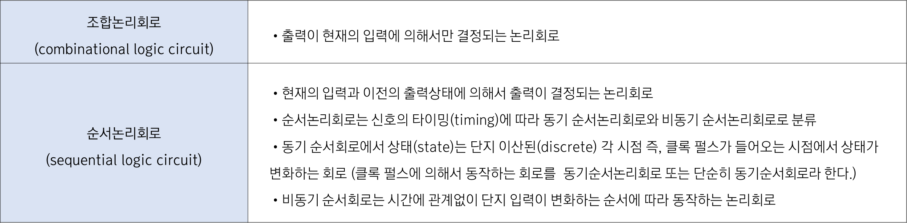

1. 조합논리회로와 순서논리회로

2. 순서논리회로의 분석 과정  
   [단계 1] 회로 입력과 출력에 대한 변수 명칭 부여  
   [단계 2] 조합논리회로가 있으면 조합논리회로의 부울 대수식 유도  
   [단계 3] 회로의 상태표 작성  
   [단계 4] 상태표를 이용하여 상태도 작성  
   [단계 5] 상태방정식 유도  
   [단계 6] 상태표와 상태도를 분석하여 회로의 동작 설명  
3. 순서논리회로의 설계 과정  
   [단계1] 사양을 분석하여 회로의 동작 과정을 간단히 기술  
   [단계2] 상태표 작성(필요에 따라 상태도, 상태 방정식 구함)  
   [단계3] 상태표 간략화  
   [단계4] 2진수 할당(F/F의 상태가 기호화 되어 있는 경우)  
   [단계5] 사용할 F/F의 종류와 수 결정  
   [단계6] 상태표로부터 여기표와 출력표 구함  
   [단계7] Karnaugh Map 등을 이용하여 F/F의 입력 함수와 출력 함수 구함  
   [단계8] 논리 회로도 완성