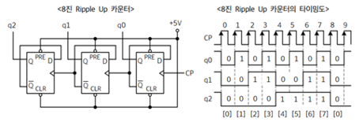
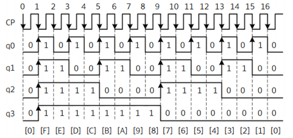

1. 비동기식 카운터
- 일반적으로 말하는 Ripple Counter이며 첫 번째 F/F의 CP 단자에만 Clock Pulse가 인가되고, 이후의 F/F 단의 CP 단자로는 전단 F/F의 출력이 Clock Pulse로 인가되는 카운터이다.
- 동작 및 회로 구성이 단순하고 구현이 용이 하나 지연시간(Propagation delay)이 누적되어 고속 동작 에는 어려움이 있다.
2. D 플립플롭(IC 7474)을 이용한 8진 Ripple-Up Counter

3. JK 플립플롭(IC 7476)을 이용한 16진 Ripple-Down Counter
