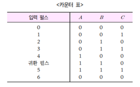
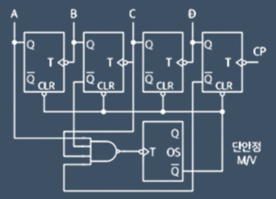
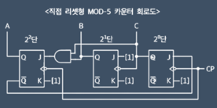

1. 귀환 카운터
- 필요에 따라 N 개의 상태만을 카운트해야 되는 경우가 있는데 이를 MOD-N 카운터라고 함
- 만일 6개의 상태만을 카운터 해야 하는 경우는 3단 F/F으로 구성하되 카운터 동작이 2단계 앞서도록 귀환시켜 주어야 함
- 즉 3단의 2진 카운터는 8개의 Pulse 뒤 0으로 리셋되나 MOS-6 카운터는 6개의 Pulse 뒤 0으로 리셋됨

2. 리셋형 카운터
- 귀환 카운터의 경우 입력 펄스의 수와 출력 단자의 2진 코드 값이 다른 문제점을 보안하기 위해 등장
- 각 단자의 출력을 논리회로에 연결하여 원하는 수가 카운팅된 후 카운터 전체를 Clear 제어 신호를 통해 리셋시켜 입력 펄스의 수와 출력의 2진 값이 일치되도록 함  

3. 직접 리셋형 카운터
- 리셋형 카운터의 단점을 없애고자 단안정 M/V를 사용하지 않고 원하는 수를 정확히 카운팅하기 위하여 해당 F/F를 직접 세트 시키는 방법으로 F/F의 동작 방식이 동기식과 비동기식으로 혼용 되어 직병렬 카운터라고도 함
- 주로 집적 회로(IC) 소자로 많이 만들어짐
