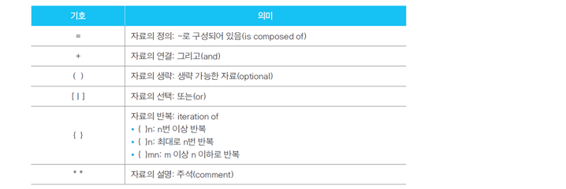

1. 구조적 분석 기법
   - 사용자의 요구분석 사항을 파악하기 위하여 자료의 흐름과 가공절차를 그림 중심으로 표현하는 방법
2. 자료흐름도
   - 요구사항 분석에서 자료의 흐름 및 변화 과정과 기능을 도형 중심으로 기술 하는 방법
   - 자료 흐름도의 표기
   - 프로세스(process), 자료 흐름(flow), 자료 저장소(data store), 단말(terminator)
3. 자료 사전
   - 자료 흐름도에 있는 자료를 더 자세히 정의하고 기록한 것이며, 이처럼 데이터를 설명하는 데이터를 데이터의 데이터 또는 메타 데이터(meta data)라고 한다.
   - 자료 흐름도에 시각적으로 표시된 자료에 대한 정보를 체계적이고 조직적으로 모아 개발자나 사용자가 편리하게 사용할 수 있다.
4. 자료 사전 표기법 및 작성 시 유의 사항
   1. 자료 사전의 한 항목은 자료에 대한 정의 부분과 설명 부분으로 구성되며, 정의 부분에는 자료의 이름을 설명 부분에는 자료에 대한 자세한 내용을 표현한다.
   2. 이름으로 정의를 쉽게 찾을 수 있어야 하며, 이름이 중복되어서는 안 된다.
   3. 갱신하기 쉬워야 하며, 정의하는 방식이 명확해야 한다.
5. 자료 사전에서 사용되는 표기 기호

6. 소단위 명세서(mini-specification)
   - 세분화된 자료 흐름도에서 최하위 단계 버블(프로세스)의 처리 절차를 기술한 것으로 프로세스 명세서
7. 개체 관계도(ERD:Entity Relationship Diagram)
   - 시스템에서 처리되는 개체(자료)와 개체의 구성과 속성, 개체 간의 관계를 표현하여 자료를 모델화하는 데 사용된다.
8. 개체 관계도 구성
   - 개체: 소프트웨어에 의해 인식되는 여러 종류의 자료
   - 속성: 개체에 관련된 특성
   - 관계: 개체 간에 존재하는 상호 작용