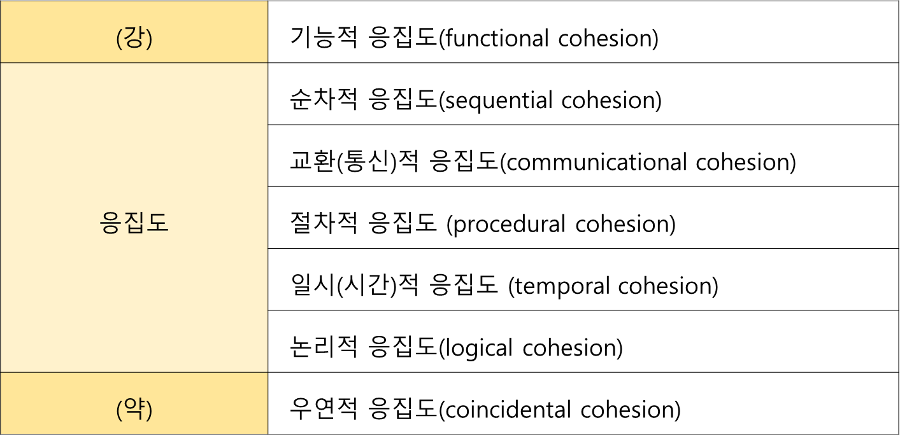
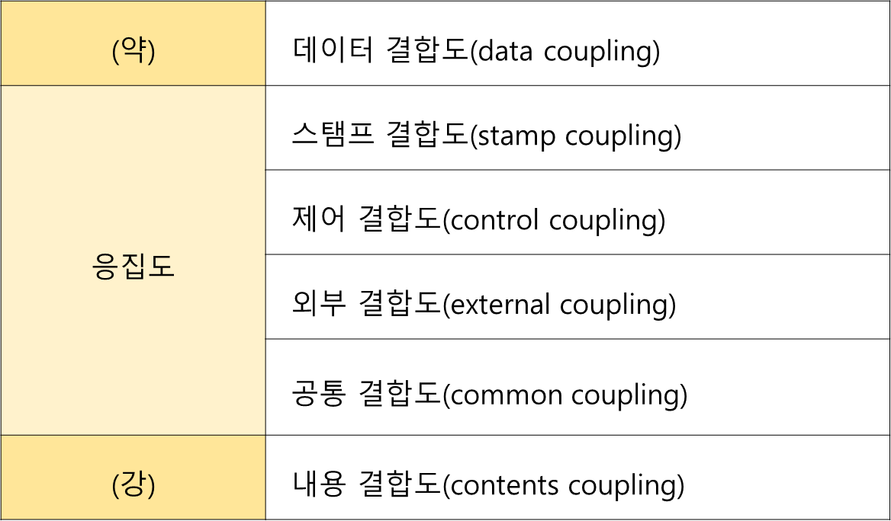

### 효율적인 모듈 설계의 기준
- 정보은닉(information hiding)
- 기능적 독립성 (functional independence)
- 기능적 독립성의 지표(응집도, 결합도)  

**독립성을 높이려면 모듈의 응집도를 강하게 결합도를 약하게 모듈의 크기를 작게 작성**
#### 모듈의 응집도 : 모듈 안의 요소들이 서로 관련되어 있는 정도, 종류는 다음과 같다.

#### 모듈의 결합도 : 모듈 간의 상호 의존도하는정도로 다음과 같은 종류가 있다.
