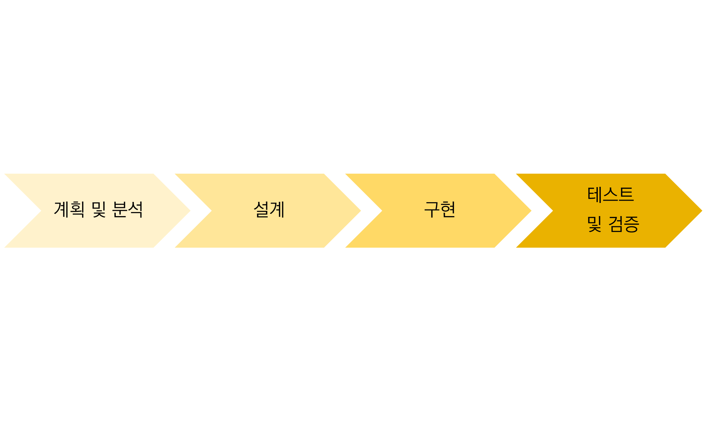
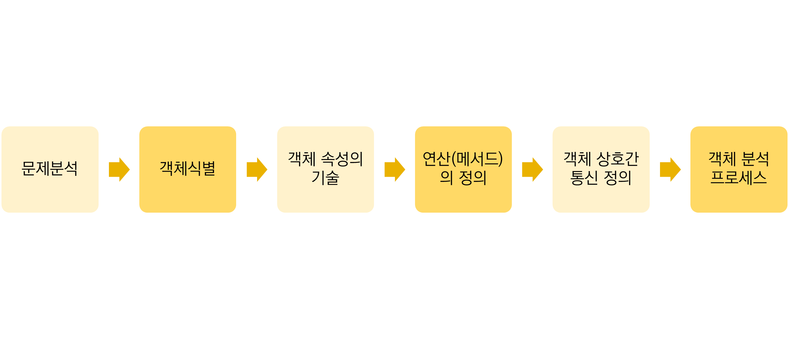

1. 객체지향 기법의 생명주기

2. 객체지향 분석
   - 사용자의 요구사항을 분석하여 요구된 문제와 관련된 모든 클래스(객체), 이와 연관된 속성과 연산, 그들 간의 관계 등을 정의하여 모델링 하는 작업이다.
3. 객체지향 분석하는 이유
   - 재사용성 향상
   - 공통된 속성 명백히 표현
   - 객체와 객체사이의 종속성 최소화
   - 소프트웨어 생명주기상에서 일관성 유지
4. 객체지향 분석의 단계

5. 객체지향 분석의 방법론

6. 럼바우 분석 기법
   -모든 소프트웨어 구성 요소를 그래픽 표기법을 이용하여 모델링 하는 기법으로, 객체 모델링 기법(OMT : Object-Modeling Technique)이라고도 한다. 객체모델링, 동적 모델링, 기능 모델링으로 구분한다.