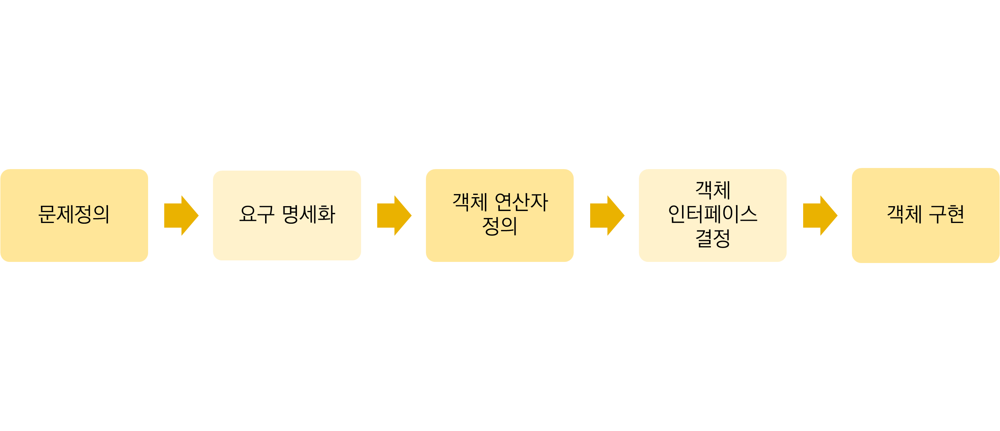

1. 객체지향 설계
   - 객체지향 분석(OOA)을 사용해서 생성한 여러 가지 분석 모델을 설계 모델로 변환하는 작업으로, 시스템 설계와 객체 설계를 수행한다.
2. 객체지향 설계단계의 순서

3. 럼바우(Rumbaugh)의 객체지향 설계
   - 시스템 설계: 전체적인 시스템 구조를 설계하는 것으로 분석 단계의 분석 모델을 서브시스템으로 분할하고, 시스템의 계층을 정의하며 분할 과정 중에서 성능의 최적 방안, 문제 해결 전략, 자원 분해 등을 확정하는 것이다.
   - 객체 설계 : 분석 단계에서 만들어진 클래스, 속성, 관계, 메시지를 이용한 통신들을 설계 모델로 제작하고 상세화하여 구체적인 자료구조와 알고리즘을 정의한다.
4. 부치(Booch)의 객체지향 설계
   - 자료 흐름도(DFD)를 사용해서 객체를 분해하고, 객체들 간의 인터페이스를 찾아 이것들을 Ada 프로그램으로 변환시키는 기법이다.
5. 객체지향 구현
   - 구현은 설계 단계에서 생성된 설계 모델과 명세서를 근거로 하여 코딩하는 단계이다.
6. 객체지향 프로그래밍의 특징
   - 재사용성(생산성 향상)
   - 확장 용이성(새로운 기능, 객체 추가 용이)
   - 신뢰성(오류없는 정확한 결과)
7. 객체의 속성
   - 유일성(식별성), 분류성(집단화), 상속성, 다형성(다양한 기능)