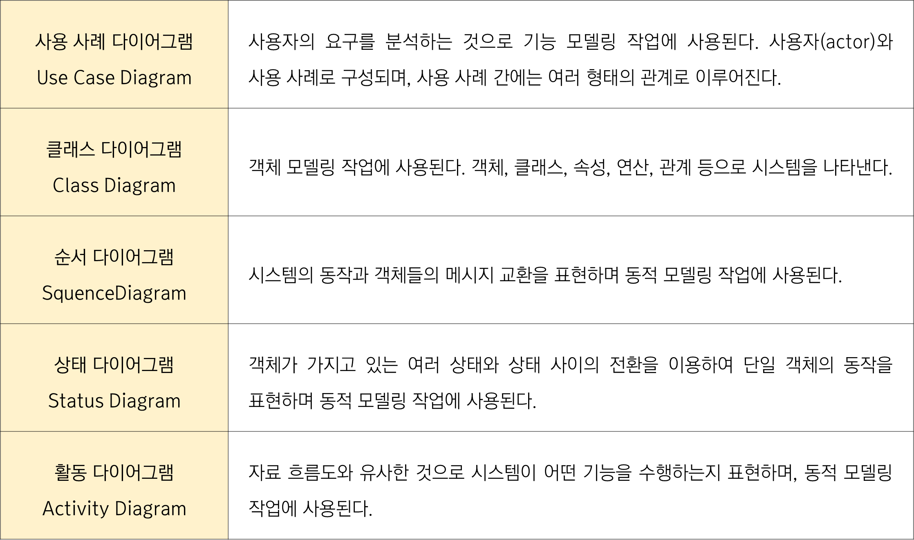

1. 형상 관리(SCM)
    - S/W SDLC 단계의 산출물을 체계적으로 관리하여 S/W 가시성 및 추적성을 부여하여 품질 보증을 향상시키는 기법
2. 형상
    - 소프트웨어 개발 단계의 과정에서 만들어지는 프로그램, 프로그램을 설명하는 문서, 데이터 등을 통칭하는 말
3. 구성요소
    - 기준선(Baseline)
    - 형상항목(Configuration item)
    - 형상물(Configuration product)
    - 형상버전(Configuration Version)
4. 형상 관리 기능
    - 형상 식별,버전 제어,변경 제어,형상 감사,형상 상태 보고
5. UML
    - 럼바우(Rumbaugh), 부치(Booch), 제이콥슨(Jacobson) 등의 객체지향 방법론의 장점을 통합한 객체지향 모델의 표준 표현 방법이다.
6. UML 다이어그램 종류
   