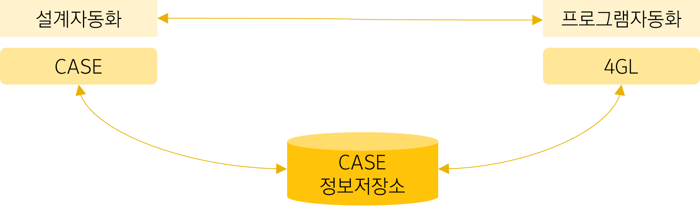

1. CASE: Computer Aided Software Engineering
   - 소프트웨어 개발 과정에서 사용되는 요구분석, 설계, 구현, 검사 및 디버깅 과정 전체 또는 일부를 컴퓨터와 전용 소프트웨어 도구를 사용하여 자동화 하는 것이다.

2. CASE 분류
   - 상위(upper) CASE: 소프트웨어 생명주기의 전반부에서 사용, 문제를 기술(description)하고 계획하며 요구 분석과 설계단계를 지원하는 CASE이다.
   - 여러 가지 명세와 문서를 작성하는 데 사용된다.
   - 하위(lower) CASE: 소프트웨어 생명주기의 하반부에서 사용되는 것으로 코드의 작성과 테스트, 문서화하는 과정을 지원하는 CASE이다.
   - 통합(intergrate) CASE: 소프트웨어 생명주기에 포함되는 전체 과정을 지원하기 위한 CASE로, 공통의 정보 저장 장소와 통일된 사용자 인터페이스를 사용하여 도구들을 통합한다.

3. 정보저장소(repository)
   - 소프트웨어를 개발하는 과정 동안에 모아진 정보를 보관하여 관리하는 곳으로 CASE 정보 저장소, CASE 데이터베이스, 요구사항 사전, 저장소라고도 한다.