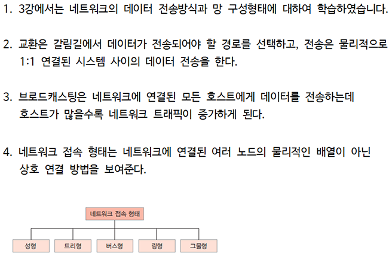

---

# 🌐 네트워크 전송 방식 요약

LAN(Local Area Network) 내에서 사용되는 주요 전송 방식은 다음과 같다:

---

## 1. 📦 유니캐스트 (Unicast)

- **정의**: 1 대 1 통신
- **사용 예시**
    - 웹 요청 (클라이언트 ↔ 서버)
    - 이메일 전송
    - 프린터 연결
- **특징**
    - 가장 일반적인 전송 방식
    - 네트워크 대역폭 효율적 사용

---

## 2. 📢 브로드캐스트 (Broadcast)

- **정의**: 1 대 전체 통신
- **사용 예시**
    - ARP (MAC 주소 탐색)
    - DHCP Discover (IP 할당 요청)
- **특징**
    - 같은 브로드캐스트 도메인에 있는 **모든 장비에게 전송**
    - 네트워크 혼잡 유발 가능성 있음

---

## 3. 🧑‍🤝‍🧑 멀티캐스트 (Multicast)

- **정의**: 1 대 다수 (특정 그룹만)
- **사용 예시**
    - IPTV
    - 실시간 주식 데이터 전송
    - 온라인 게임 로비
- **특징**
    - 그룹 주소 사용 (224.0.0.0 ~ 239.255.255.255)
    - 일반 스위치가 멀티캐스트 처리 지원해야 효과적임

---

## 4. 🧭 애니캐스트 (Anycast)

- **정의**: 1 대 가장 가까운 1명 (최단 거리)
- **사용 예시**
    - DNS 루트 서버
    - CDN(Content Delivery Network)
- **특징**
    - **LAN에서는 거의 안 씀**
    - 주로 WAN, 글로벌 라우팅에서 사용됨

---

## 🔍 실제 LAN 상황별 사용 방식

| 상황                       | 사용 방식     |
|----------------------------|---------------|
| DHCP 요청 (IP 주소 요청)   | Broadcast      |
| ARP (MAC 주소 탐색)        | Broadcast      |
| PC ↔ 서버 통신             | Unicast        |
| IPTV, 스트리밍 그룹 송출   | Multicast      |
| 게임 서버 ↔ 로비 참가자들 | Multicast      |
| 웹 요청, 파일 전송         | Unicast        |

---

## ✅ 요약

- **대부분 LAN 통신은 유니캐스트**
- **장치 탐색/요청 계열은 브로드캐스트**
- **멀티미디어/그룹 통신은 멀티캐스트**
- **애니캐스트는 주로 WAN 영역**

---
# 🌐 네트워크 토폴로지 - 실무에서 실제로 쓰는가?

---

## ✅ 네트워크 토폴로지란?

- **정의**: 네트워크에서 장비(노드)들이 어떻게 연결되어 있는지를 도식화한 구조
- **종류**:
    - 버스형 (Bus)
    - **성형 (Star)**
    - 링형 (Ring)
    - **그물형 (Mesh)**
    - 트리형 (Tree)
    - 하이브리드형 (Hybrid)

---

## 💼 실무에서 실제 사용되는 토폴로지

| 토폴로지 | 실무 적용도 | 설명 |
|----------|--------------|------|
| **성형 (Star)** | ⭐⭐⭐⭐ | 스위치 중심 구조. 대부분의 **LAN 구성**이 해당됨 |
| **트리형 (Tree)** | ⭐⭐⭐⭐ | 성형 구조를 계층적으로 확장. **기업/학교** 등에서 흔함 |
| **하이브리드형** | ⭐⭐⭐⭐ | 데이터센터 및 클라우드 환경에서 사용됨 (예: 스파인-리프 구조) |
| **그물형 (Full Mesh)** | ⭐⭐ | 통신사 백본, 데이터센터의 고가용성 구성 등에서 사용 |
| **버스형 / 링형** | ⭐ | **거의 사용되지 않음.** 과거 기술에서 등장했지만 현재는 퇴출됨 |

---

## 🧠 실무 적용 예시

### ▶️ 1. 성형 (Star)
- **중앙 스위치/허브**에 모든 장비가 연결된 구조
- **기업, 학교, 가정 LAN** 등에서 일반적으로 사용
- 장애 발생 시, 개별 노드에만 영향

### ▶️ 2. 트리형 (Tree)
- 성형 구조를 **계층적으로 구성**한 형태
- **코어 - 배포 - 엑세스 계층**으로 구성
- 중대형 네트워크에 적합 (학교 캠퍼스, 대형 빌딩 등)

### ▶️ 3. 하이브리드형 (Hybrid)
- **성형 + 그물형 등 혼합 구조**
- 예: 데이터센터의 **스파인-리프 구조**
- **확장성, 고가용성, 성능 최**
