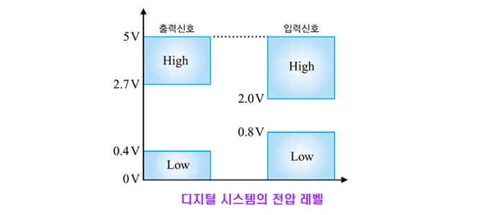

1. 디지털 신호
    - 이산 시간(Discrete Time), 이산 진폭(Discrete Amplitude) 신호
    - 분명히 구별되는 서로 다른 (두) 레벨의 신호 값만을 가짐

2. 디지털 시스템의 특징
    - 내·외부 잡음에 강함
    - 시스템 변경 및 설계가 용이함
    - 프로그래밍으로 전체 시스템 제어가 가능함
    - 기능 구현의 유연성을 높일 수 있고 개발 기간을 단축시킬 수 있음
    - 정보를 저장하거나 가공하기가 용이함
    - 정보 처리의 정확성과 정밀도를 높일 수 있으며, 아날로그 시스템으로는 다루기 어려운 비선형 처리나 다중화 처리 등도 가능함
    - 전체 시스템 구성을 소형화, 저가격화로 할 수 있음
    -
3. 디지털 신호 변환 기술(PCM)
    - D/A 변환: Digital to Analog Converting
    - A/D 변환: Analog to Digital Converting
    - ADC(Analog to Digital Converter) 일명 PCM (Pulse Code Modulation)이라고도 함
    - 표본화, 양자화 및 부호화 과정을 거쳐서 디지털 신호로 변화

   한 줄로 요약

👉 PCM = “소리를 그대로 숫자로 찍어놓은 원본 데이터”
👉 모든 오디오 처리의 출발점

---

1. 디지털 정보의 전압 레벨
   - 디지털 정보를 표현하기 위해 2진수 체계(binary systerm)을 사용
   - "0"과 "1"만의 2종류의 디지트(digit)를 사용
     

2. 논리 펄스 파형
   - 상승 기간, 하강 시간, 펄스폭
   - 주기, 주파수, 듀티사이클
      

