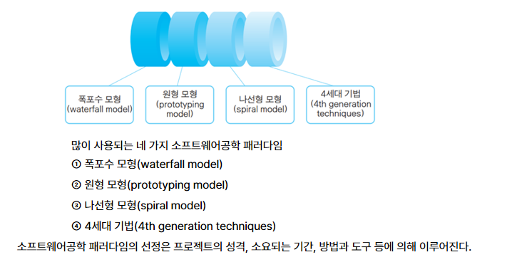

1. **소프트웨어 개발 방법론**은 소프트웨어공학 패러다임 또는 소프트웨어 생명주기 모형이라고도 하며 개발 방법, 개발 환경, 개발 관리 등을 포함한다.

2. S/W 개발 방법론의 종류
   - 구조적 방법론, 정보공학 방법론, 객체지향 방법론, CBD 방법론

--- 

### **한 줄 결론 (깔끔)**
> **개발 방법론은 ‘운영 전략**’이고,  
> **패러다임은 ‘사고 도구**’다.  
> 둘은 섞어서 상황 맞게 쓴다.