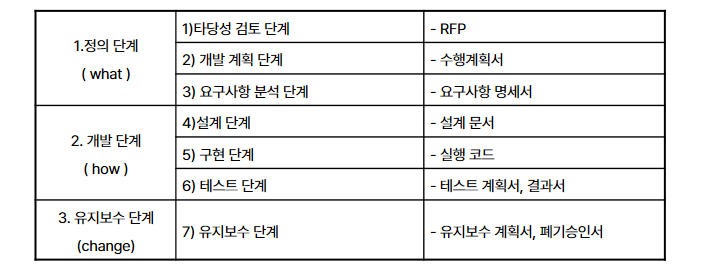

1. S/W 개발 생명주기(Software Development Life Cycle)의 정의
   - S/W 개발 방법론의 바탕이 되는 것으로 S/W를 개발하기 위해 과정을 각 단계별로 나눈 것
2. S/W 개발 생명주기(Software Development Life Cycle)의 일반적 공정 과정

3. SW품질보증 활동 충족 조건
   1. 사용자가 요구하는 기능적인 요구사항들이 만족
   2. 요구사항에 대한 부합여부가 시스템 구축 전 과정에 걸쳐 확인
   3. 시스템의 성능에 관한 사양이 만족
   4. 정해진 비용과 기간의 목표가 만족
4. 유지보수의 4가지 활동
   1. 잘못된 것을 수정하는 유지보수(corrective maintenance)-수정
   2. 시스템을 새 환경에 적응시키는 유지보수(adaptive maintenance)-적응
   3. 새로운 기능을 추가하는 유지보수(perfective maintenance)-완전
   4. 미래의 시스템 관리를 위한 유지보수(preventive maintenance)-예방
   5. SDLC 장,단점   
      ● 장점
      - SW 개발 과정을 쉽게 이해하기 위한 효과적인 도구
      - SW 유형, 관점, 개발 방침, 요구 사항, 표준 정책에 따라 다양한 방법이 존재
      - 요구사항 정의, 설계, 프로그래밍 등에 대한 기법들을 활용한 템플릿이 제공될 수 있음
      - 체계적인 문서화, 단계별 산출물 체크를 통한 프로젝트 진행의 명확화
   
      ● 단점
      - 문서 중심의 개발 접근 방식으로 개발자가 문서화에 대한 부담 가중
      - 개발 초기에 사용자의 요구사항을 명확하게 찾아내기 어려움
      - 완벽한 분석이 요구되며 피드백과정이 없어 변경이 어려움